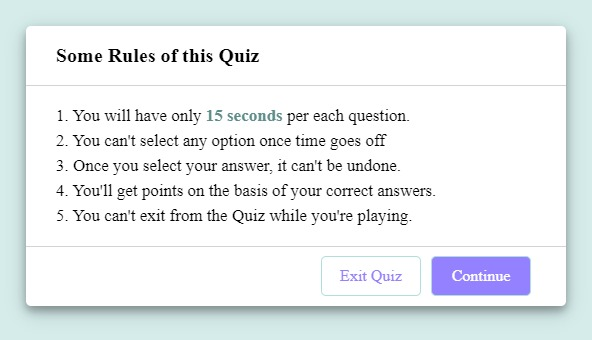
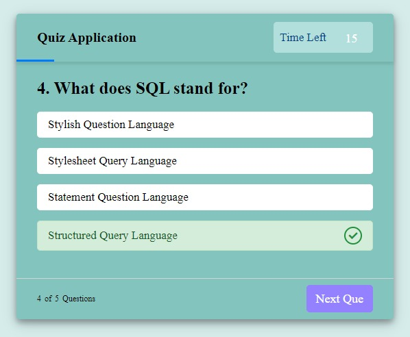
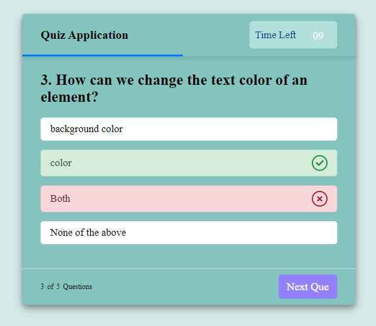
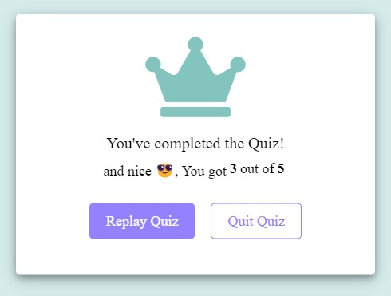

# Basic Quiz Application

 

A simple webpage made using HTML, CSS, and JavaScript for self-learning purpose.
  

---

## Demo

 

You can view the demo of this application by following <a href="https://basic-quiz-application.netlify.app/" target="_blank">this link</a> . Although I have also provided the screenshots below of exactly how it looks like. 
For this one, I have used <a href="https://app.netlify.com" target="_blank">Netlify</a> to host the quiz.
 

Here is the ss of the application

 

---

## Features

 

- Easy to use quiz application.

- Simple and Intuitive UI design, i.e.&ensp;**_less code but more fun_**.

- Editable `questions.js` file to extend the quiz with more questions.

- Each question has a time limit of 15 seconds **(You can even change this too, to your need)**.

- Can be used to test the knowledge of your friends for fun purposes.

- At the end, you will also be awarded by the score you scored in the quiz.
    

---

## Usage

 

1. Clone the repository:

> git clone https://github.com/priyanshu-baran/Basic_Quiz_Application.git

2. Navigate to the cloned directory and open the index.html file in your browser.

> cd Basic_Quiz_Application

> **_Recommend:_** I will recommend using [Live Server Extension](https://marketplace.visualstudio.com/items?itemName=ritwickdey.LiveServer) here as it will help you a lot while working with .htm or .html files.

3. Start the quiz by clicking the "Start" button.

4. Answer all the questions within the given time limit.

5. After that submit your answers and see your score.
     

---

## Contributing

 

If you would like to contribute to this repo `Basic Quiz Application`, please fork the repository and submit a pull request with your changes. Contributions are welcome and encouraged!
  

---

## Like this project? 🤩

 

If you are feeling generous, buy me a coffee...!!! ☕ 

  

---

### Happy Coding...!! 👨🏽‍💻👨🏽‍💻
